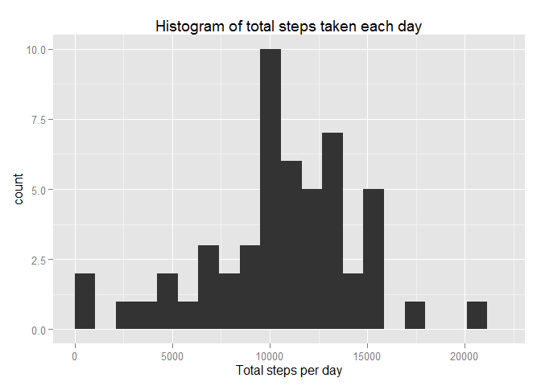
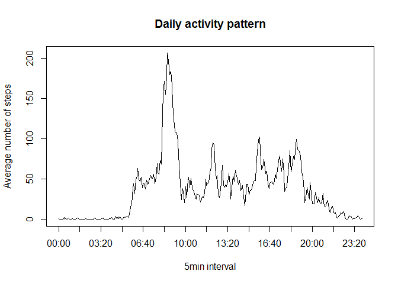
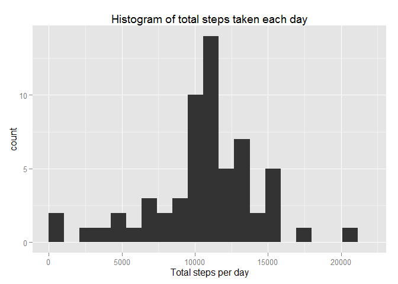
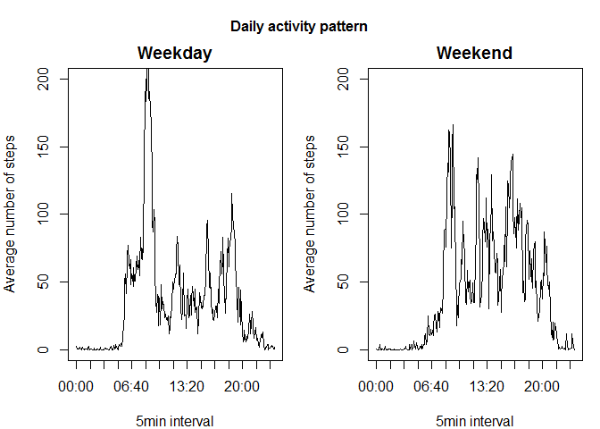

# Reproducible Research: Peer Assessment 1


# Introduction

This work analyses the data from a personal activity monitoring device. This device collects data at 5 minutes inverval through out the day. The data consists of two months of data from an anonymous individual collected during the months of October and Novermber 2012 and include the number of steps taken in 5 minutes' intervals each day.

## Loading and preprocessing the data
Firstly we will load the data using following code:

```r
Dir = "D:/Online course/Coursera/5. Reproducible research/Project 1/"
setwd(Dir)
Data = read.csv("activity.csv", header=T, sep = ",")
```

... and transform the date and time to a suitable format, reformating the date and time:

```r
a = Data$interval
a[nchar(a)==3] = paste("0",a,sep="")[nchar(a)==3]
a[nchar(a)==2] = paste("00",a,sep="")[nchar(a)==2]
a[nchar(a)==1] = paste("000",a,sep="")[nchar(a)==1]
a = paste(substr(a, 1, 2), ":", substr(a, 3, 4), sep="")
Data$interval = a
Data = transform(Data, date = as.Date(date, format="%m/%d/%Y"))
```


## What is mean total number of steps taken per day?
The total number of steps taken per day are caclulated as

```r
TotSteps = as.data.frame(tapply(Data$steps, Data$date, sum))
colnames(TotSteps) = "Total.Steps"                         
```

Use this data we can make a histogram to see the distribution of the total number of steps taken each day

```r
rng = range(TotSteps$Total.Steps, na.rm=T)
library(ggplot2)
ggplot(TotSteps, aes(TotSteps$Total.Steps))+geom_histogram(binwidth = (rng[2] - rng[1])/20) + labs(title = "Histogram of total steps taken each day", x = "Total steps per day") + xlim(c(0,22000))
```

 

We also want to find out the mean and median of total number of steps taken per day


```r
MeanSteps1 = mean(TotSteps$Total.Steps, na.rm=T)
MedianSteps1 = median(TotSteps$Total.Steps, na.rm=T)
```
The mean is 

```r
MeanSteps1
```

```
## [1] 10766.19
```
and median is 

```r
MedianSteps1
```

```
## [1] 10765
```


## What is the average daily activity pattern?

To find the daily activity pattern, we calculate the average step in each 5 minutes' interval and plot the time series

```r
AvgSteps = as.data.frame(tapply(Data$steps, Data$interval, mean, na.rm=T))
colnames(AvgSteps) = "Average.Steps"
plot(AvgSteps, type = "l", xaxt = "n", xlab = "5min interval", ylab = "Average number of steps", main = "Daily activity pattern")
freq = seq(1, nrow(AvgSteps), by = 20)
axis(1, at=freq, labels = rownames(AvgSteps)[freq])
```

 

The 5-minute interval that contains maximum number of steps is

```r
rownames(AvgSteps)[which(AvgSteps==max(AvgSteps))]
```

```
## [1] "08:35"
```

This may correspond to the time when people go to work.

## Imputing missing values

Total number of missing values in the dataset is

```r
sum(is.na(Data$steps))
```

```
## [1] 2304
```
The percentage of the missiong values is

```r
sum(is.na(Data$steps))/nrow(Data)
```

```
## [1] 0.1311475
```

To deal with the mssing values, we fill them with interval mean and creat a new dataset Data2

```r
MeanSteps = tapply(Data$steps, Data$interval, mean, na.rm=T)
Data2 = Data
for (i in 1:length(MeanSteps))
{
  Missing = intersect(which(Data2$interval == names(MeanSteps)[i]), which(is.na(Data2$steps)))
  Data2[Missing, "steps"] = MeanSteps[i] 
}
```

Make histogram of total number of steps taken each day for the new dataset

```r
TotSteps = as.data.frame(tapply(Data2$steps, Data$date, sum))
colnames(TotSteps) = "Total.Steps"                         
rng = range(TotSteps$Total.Steps, na.rm=T)
ggplot(TotSteps, aes(TotSteps$Total.Steps))+geom_histogram(binwidth = (rng[2] - rng[1])/20) + labs(title = "Histogram of total steps taken each day", x = "Total steps per day") + xlim(c(0,22000))
```

 

Calculate the mean and median of total number steps taken eacy day for the new data set

```r
MeanSteps2 = mean(TotSteps$Total.Steps, na.rm=T)
MedianSteps2 = median(TotSteps$Total.Steps, na.rm=T)
MeanSteps2
```

```
## [1] 10766.19
```

```r
MedianSteps2
```

```
## [1] 10766.19
```

Due to the way we handle the missing value, there is no difference in mean and the difference in median is very small

```r
MeanSteps1 - MeanSteps2
```

```
## [1] 0
```

```r
MedianSteps1 - MedianSteps2
```

```
## [1] -1.188679
```

## Are there differences in activity patterns between weekdays and weekends?
Firstly we creat a factor indicating weekdays and weekends

```r
library(dplyr)
```

```
## 
## Attaching package: 'dplyr'
## 
## The following object is masked from 'package:stats':
## 
##     filter
## 
## The following objects are masked from 'package:base':
## 
##     intersect, setdiff, setequal, union
```

```r
Day = rep("weekday", nrow(Data2))
Day[which((weekdays(Data2$date)=="Saturday")|(weekdays(Data2$date)=="Sunday"))] = "weekend"
Day = as.factor(Day)
Data2 = cbind(Data2, Day)
```
Calculate the average number of steps taken in each 5-minute interval during the day

```r
group = group_by(Data2, Day, interval)
Avg = summarise(group, mean(steps))
colnames(Avg) = c("Day", "interval", "Average.Steps")
```
Plot the charts for weekdays and weekends

```r
par(mfrow=c(1,2), mar = c(4, 4, 2, 1), oma = c(0, 0, 2, 0))
plot(Avg$Average.Steps[Avg$Day == "weekday"], type = "l", ylim=c(0,200), xaxt = "n", xlab = "5min interval", ylab = "Average number of steps", main = "Weekday")
freq = seq(1, nrow(AvgSteps), by = 20)
axis(1, at=freq, labels = Avg$interval[freq])

plot(Avg$Average.Steps[Avg$Day == "weekend"], type = "l", ylim=c(0,200), xaxt = "n", xlab = "5min interval", ylab = "Average number of steps", main = "Weekend")
axis(1, at=freq, labels = Avg$interval[freq])

mtext("Daily activity pattern", font = 2, outer=TRUE)
```

 

The results indicate a decrease in number of steps in the mornings in weekends when people usually go to work during weekeday and an increase in number of steps during the day time in weekends.

